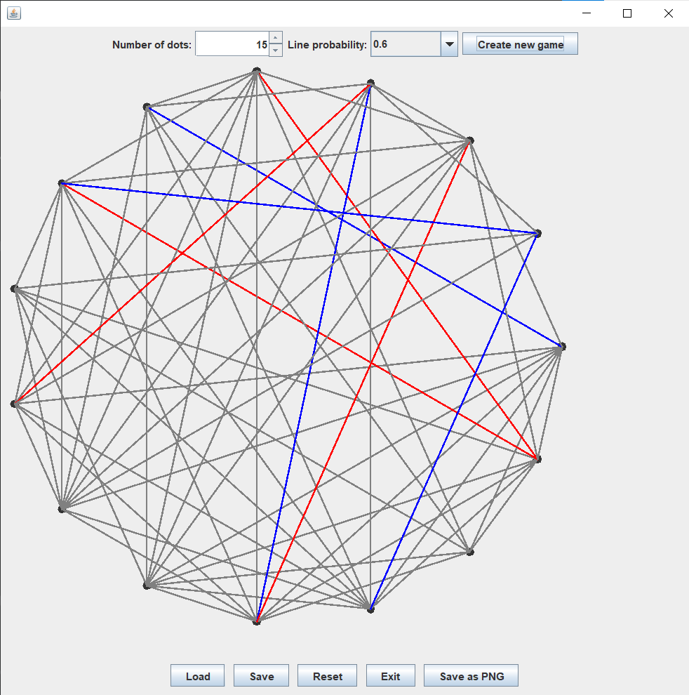

# Lab 6

* [x] Compulsory
  
* [ ] Homework
    * [x] Object-oriented model of the game
    * [x] Ability to select lines and color them accordingly

```java
class Canvas {
    // ...
    @Override
    protected void paintComponent(Graphics g) {
        super.paintComponent(g);
        Graphics2D g2d = (Graphics2D) g;
        g2d.setStroke(new BasicStroke(2)); // sets line thickness

        for (Point point : pointList) {
            int x = point.x, y = point.y;
            g.fillOval(x - DOT_SIZE / 2, y - DOT_SIZE / 2, DOT_SIZE, DOT_SIZE);
        }

        for (Edge edge : edges) {
            g.setColor(edge.lineColor == LineColor.RED ? Color.RED
                    : edge.lineColor == LineColor.BLUE ? Color.BLUE : Color.GRAY);
            g.drawLine(pointList.get(edge.x).x, pointList.get(edge.x).y,
                    pointList.get(edge.y).x, pointList.get(edge.y).y);
        }
    }

    // ...
    private void handleClick(Point clickPoint) {
        Edge selectedEdge = findClosestEdge(clickPoint);
        if (selectedEdge != null && selectedEdge.lineColor == LineColor.GRAY) {
            selectedEdge.lineColor = currentPlayer == Player.RED ? LineColor.RED : LineColor.BLUE;
            if (checkForTriangle(currentPlayer)) {
                JOptionPane.showMessageDialog(this,
                        currentPlayer + " player wins!", "Game Over",
                        JOptionPane.INFORMATION_MESSAGE);
                setEnabled(false);
            } else {
                currentPlayer = currentPlayer == Player.RED ? Player.BLUE : Player.RED;
            }
            repaint();
        }
    }
}
```

    * [x] Export the game to PNG
    * [x] Use object serialization to save & restore status of the game

```java
class Window {
    // ...
    void createBottomPanel() {
        // ...
        save.addActionListener(e -> {
            if (canvas != null) {
                try (FileWriter fileWriter = new FileWriter(SAVE_FILE)) {
                    ObjectMapper objectMapper = new ObjectMapper();
                    CanvasData canvasData = new CanvasData(canvas.numberOfDots, canvas.width, canvas.height,
                            canvas.lineProbability, canvas.edges);
                    objectMapper.writeValue(fileWriter, canvasData);
                } catch (IOException exception) {
                    JOptionPane.showMessageDialog(this,
                            "An error occurred while saving the file: " + exception.getMessage(),
                            "Save Error", JOptionPane.ERROR_MESSAGE);
                }
            }
        });
        load.addActionListener(e -> {
            try (FileReader fileReader = new FileReader(SAVE_FILE)) {
                ObjectMapper objectMapper = new ObjectMapper();
                CanvasData canvasData = objectMapper.readValue(fileReader, CanvasData.class);

                if (canvas != null) {
                    remove(canvas);
                }
                canvas = new Canvas(canvasData.numberOfDots, canvasData.width, canvasData.height,
                        canvasData.lineProbability, canvasData.edges);
                numberOfDotsButton.setValue(canvasData.numberOfDots);
                probabilityBox.setSelectedIndex((int) (canvasData.lineProbability / 0.1 - 1));
                add(canvas, BorderLayout.CENTER);
                setVisible(true);
            } catch (IOException exception) {
                System.out.println(exception.getMessage());
                JOptionPane.showMessageDialog(this,
                        "An error occurred while loading the file: " + exception.getMessage(),
                        "Load Error", JOptionPane.ERROR_MESSAGE);
            }
        });
        // ...
    }
    // ...
}
```

* [x] Bonus
    * [x] Implement a non-trivial AI for the game
```java
class GameState {
    // ...
    // AI plays RED, so position is evaluated from its perspective
    // a positive score is good for the AI, a negative one is bad
    int evaluatePosition(Canvas canvas, Player playerToMove) {
        Graph graphWithEdgesOfPlayer = getGraphWithEdgesOfPlayer(canvas, playerToMove);
        int mxPotential = -100;
        for (Edge edge : canvas.edges)
            if (edge.getLineColor() == Canvas.LineColor.GRAY) {
                graphWithEdgesOfPlayer.addEdge(edge.getX(), edge.getY());
                int playerPotentialTriangles =
                        TriangleCounter.countTriangles(graphWithEdgesOfPlayer.adjacencyMatrix());
                mxPotential = Math.max(mxPotential, playerPotentialTriangles);
                graphWithEdgesOfPlayer.removeEdge(edge.getX(), edge.getY());
            }
        if (playerToMove == Player.RED)
            return mxPotential * 100;
        else
            return mxPotential * (-100);
    }
    // ...
}
```
* [x] Implemented `O(N^3)` algorithm using matrix exponentiation.
      When raising the adjacency matrix to the power k, we get
      `matrix[i][j]` = number of path from `i` to `j` of length `k`
      We raise to the third power, so we get all paths of length 3,
      but we have to consider duplicates so we divide by 6

```java
public class TriangleCounter {
    public static int countTriangles(int[][] adjacencyMatrix) {
        int[][] A3 = matrixPower(adjacencyMatrix, 3);
        int count = 0;
        for (int i = 0; i < A3.length; i++) {
            count += A3[i][i];
        }
        return count / 6;
    }
    // ...
}
```